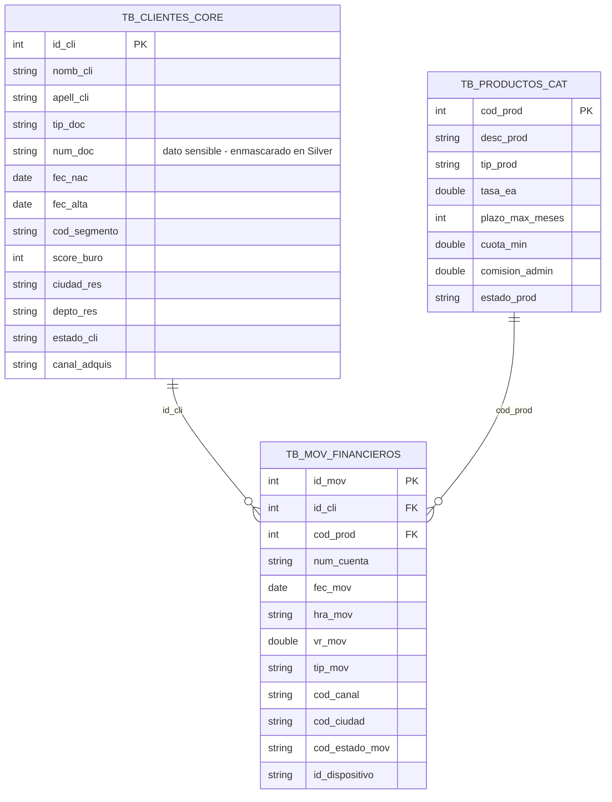
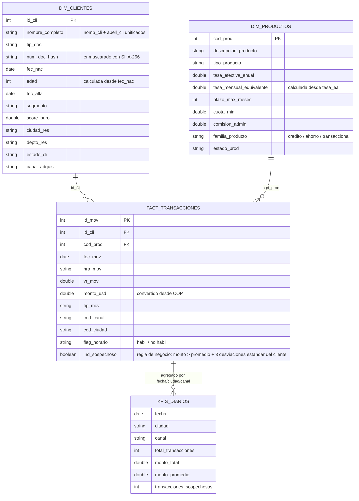
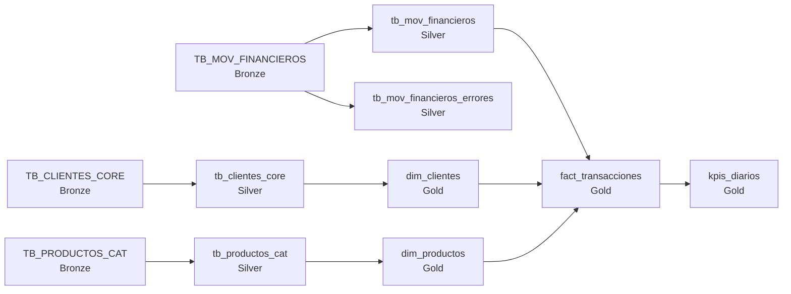

# Diagrama Entidad-Relación — FinBank Pipeline

## Modelo de origen (capa Bronze/Silver)

```mermaid
erDiagram
    TB_CLIENTES_CORE ||--o{ TB_MOV_FINANCIEROS : "id_cli"
    TB_PRODUCTOS_CAT ||--o{ TB_MOV_FINANCIEROS : "cod_prod"

    TB_CLIENTES_CORE {
        int id_cli PK
        string nomb_cli
        string apell_cli
        string tip_doc
        string num_doc "dato sensible - enmascarado en Silver"
        date fec_nac
        date fec_alta
        string cod_segmento
        int score_buro
        string ciudad_res
        string depto_res
        string estado_cli
        string canal_adquis
    }

    TB_PRODUCTOS_CAT {
        int cod_prod PK
        string desc_prod
        string tip_prod
        double tasa_ea
        int plazo_max_meses
        double cuota_min
        double comision_admin
        string estado_prod
    }

    TB_MOV_FINANCIEROS {
        int id_mov PK
        int id_cli FK
        int cod_prod FK
        string num_cuenta
        date fec_mov
        string hra_mov
        double vr_mov
        string tip_mov
        string cod_canal
        string cod_ciudad
        string cod_estado_mov
        string id_dispositivo
    }
```

## Modelo dimensional (capa Gold)

```mermaid
erDiagram
    DIM_CLIENTES ||--o{ FACT_TRANSACCIONES : "id_cli"
    DIM_PRODUCTOS ||--o{ FACT_TRANSACCIONES : "cod_prod"
    FACT_TRANSACCIONES ||--o{ KPIS_DIARIOS : "agregado por fecha/ciudad/canal"

    DIM_CLIENTES {
        int id_cli PK
        string nombre_completo "nomb_cli + apell_cli unificados"
        string tip_doc
        string num_doc_hash "enmascarado con SHA-256"
        date fec_nac
        int edad "calculada desde fec_nac"
        date fec_alta
        string segmento
        double score_buro
        string ciudad_res
        string depto_res
        string estado_cli
        string canal_adquis
    }

    DIM_PRODUCTOS {
        int cod_prod PK
        string descripcion_producto
        string tipo_producto
        double tasa_efectiva_anual
        double tasa_mensual_equivalente "calculada desde tasa_ea"
        int plazo_max_meses
        double cuota_min
        double comision_admin
        string familia_producto "credito / ahorro / transaccional"
        string estado_prod
    }

    FACT_TRANSACCIONES {
        int id_mov PK
        int id_cli FK
        int cod_prod FK
        date fec_mov
        string hra_mov
        double vr_mov
        double monto_usd "convertido desde COP"
        string tip_mov
        string cod_canal
        string cod_ciudad
        string flag_horario "habil / no habil"
        boolean ind_sospechoso "regla de negocio: monto > promedio + 3 desviaciones estandar del cliente"
    }

    KPIS_DIARIOS {
        date fecha
        string ciudad
        string canal
        int total_transacciones
        double monto_total
        double monto_promedio
        int transacciones_sospechosas
    }
```

## Flujo de linaje (Bronze → Silver → Gold)

```mermaid
flowchart LR
    A[TB_CLIENTES_CORE\nBronze] --> B[tb_clientes_core\nSilver]
    C[TB_PRODUCTOS_CAT\nBronze] --> D[tb_productos_cat\nSilver]
    E[TB_MOV_FINANCIEROS\nBronze] --> F[tb_mov_financieros\nSilver]
    E --> G[tb_mov_financieros_errores\nSilver]

    B --> H[dim_clientes\nGold]
    D --> I[dim_productos\nGold]
    F --> J[fact_transacciones\nGold]
    H --> J
    I --> J
    J --> K[kpis_diarios\nGold]
```
